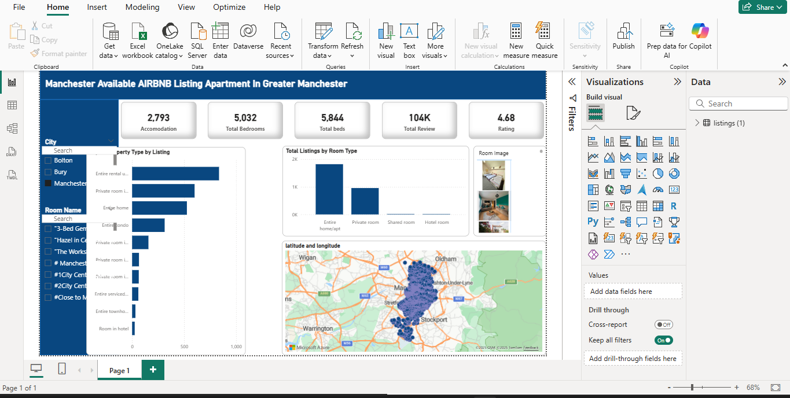

# Airbnb Data Analysis Dashboard – Power BI  

This project presents an **interactive Power BI dashboard** analyzing Airbnb property listings and market trends. It provides insights into pricing, availability, property distribution, and occupancy patterns.  

## Features  
- Pricing analysis across cities/regions  
- Comparison of property types and host performance  
- Availability trends by month/season  
- Interactive filters for deeper exploration  

## Tools & Skills  
- **Power BI**: Data modeling, DAX, and visualization  
- **Data Analysis**: Cleaning and transforming Airbnb dataset  
- **Storytelling with Data**: Turning raw data into actionable insights  

# Airbnb Power BI Dashboard  

## Repository Contents  
- `.pbix` file: Power BI dashboard  
- `.mp4` file: Demo video of dashboard walkthrough

This project demonstrates my ability to work with real-world data, design insightful dashboards, and communicate findings effectively.  
